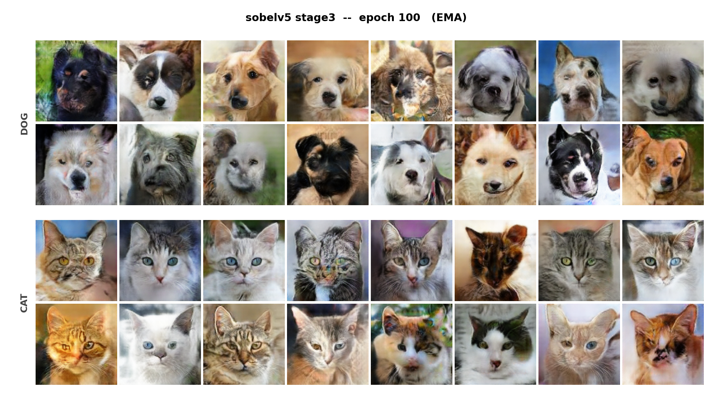
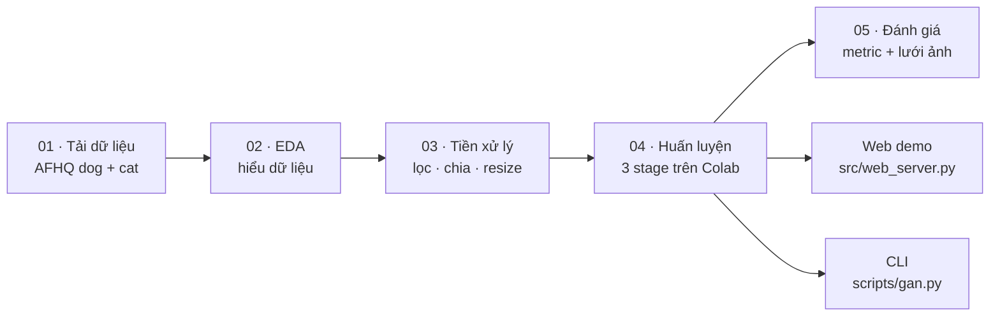
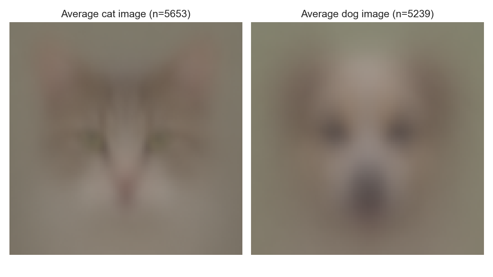
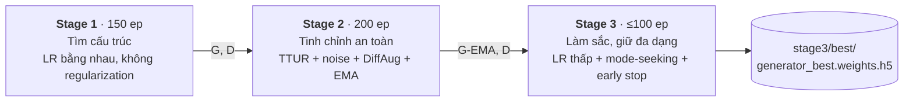
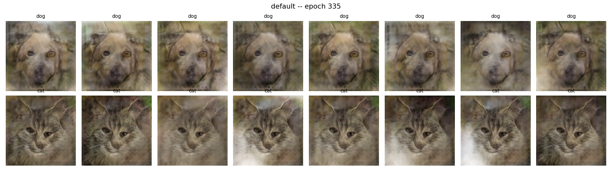
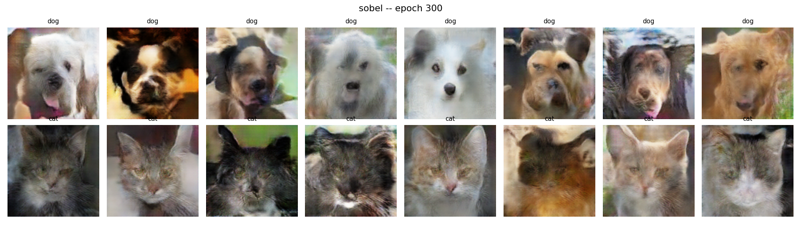
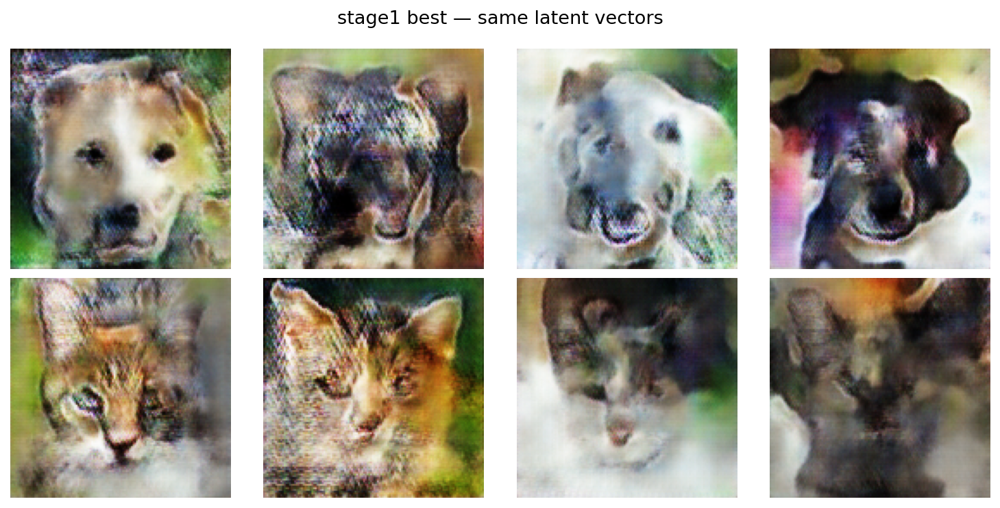
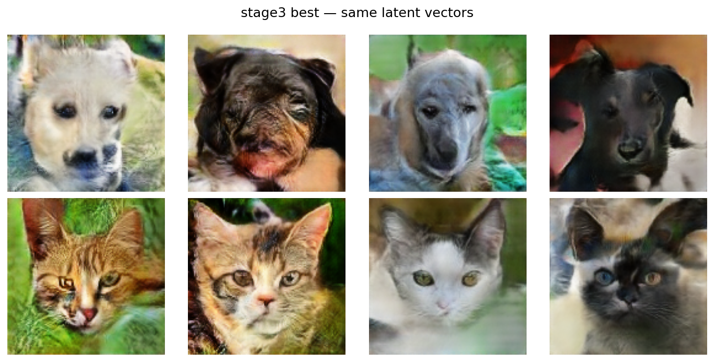
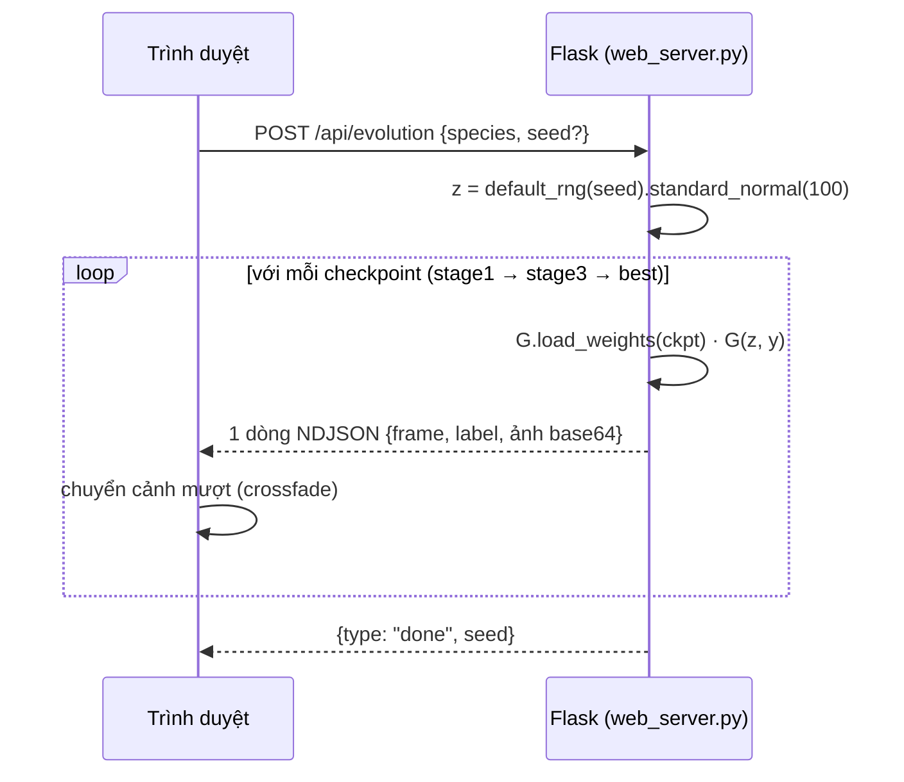

<div align="center">

# 🐶 Dogs & Cats by GANs 🐱

**Sinh ảnh mặt chó và mèo 128×128 bằng một Conditional DCGAN, trong đó Discriminator được đưa thêm một kênh cạnh Sobel**




<sub>Toàn bộ 32 khuôn mặt trên đều do mô hình <code>sobelv5</code> sinh ra (stage 3, epoch 100, bản EMA). Hàng trên là chó, hàng dưới là mèo.</sub>

</div>

> [!NOTE]
> Đây là dự án **học tập**. Mục tiêu là hiểu cách một GAN có điều kiện học, cách nó hư (mode collapse, Discriminator áp đảo) và cách giữ nó ổn định. Dự án **không** nhằm tối ưu để ra ảnh đẹp nhất hay cạnh tranh với StyleGAN/diffusion.

---

## ⚡ Chạy nhanh

```bash
git clone --depth 1 https://github.com/peotrannnn/Dogs-and-cats-by-GANs.git
cd Dogs-and-cats-by-GANs
pip install -r requirements-web.txt

python scripts/gan.py generate --species both -n 8     # sinh 8 chó + 8 mèo → outputs/
python scripts/gan.py serve                            # web demo tại http://127.0.0.1:5000
```

---

## 📑 Mục lục

| | | |
|---|---|---|
| 1. [Bài toán](#1--phát-biểu-bài-toán) | 6. [Huấn luyện 3 giai đoạn](#6--quy-trình-huấn-luyện-3-giai-đoạn) | 11. [Web demo](#11--web-demo) |
| 2. [Thử thách](#2--thử-thách) | 7. [Theo dõi và chọn mô hình](#7--theo-dõi-và-chọn-mô-hình) | 12. [Chạy lại pipeline](#12--chạy-lại-toàn-bộ-pipeline) |
| 3. [Mục tiêu](#3--mục-tiêu-thí-nghiệm) | 8. [Các thí nghiệm](#8--các-thí-nghiệm) | 13. [Cấu trúc thư mục](#13--cấu-trúc-thư-mục) |
| 4. [Pipeline và notebook](#4--pipeline-và-trọng-tâm-từng-notebook) | 9. [Kết quả](#9--kết-quả) | 14. [Hạn chế](#14--hạn-chế-đã-biết) |
| 5. [Mô hình](#5--mô-hình) | 10. [Lệnh tiện dụng](#10--lệnh-tiện-dụng-scriptsganpy) | 15. [Tham khảo](#15--tham-khảo-và-giấy-phép) |

---

## 1. 🧮 Phát biểu bài toán

Mỗi mẫu dữ liệu gồm một ảnh mặt thú đã chuẩn hoá $x \in [-1, 1]^{128 \times 128 \times 3}$ và một nhãn loài $y \in \lbrace 0, 1 \rbrace$ (0 = chó, 1 = mèo). Ảnh thật được lấy từ một phân phối có điều kiện chưa biết $p_{\text{data}}(x \mid y)$.

**Mục tiêu:** học một Generator

$$
G_\theta : (z, y) \longmapsto \hat{x} \in [-1,1]^{128\times128\times3}, \qquad z \sim \mathcal{N}(0, I_{100}),
$$

sao cho với **mỗi loài** $y$, phân phối ảnh sinh ra $p_G(\hat{x} \mid y)$ gần với $p_{\text{data}}(x \mid y)$.

**Cách học:** $G_\theta$ được huấn luyện đối kháng với một Discriminator $D_\phi(x, y) \in \mathbb{R}$ (trả về logit). $D_\phi$ cố phân biệt ảnh thật với ảnh giả **của cùng một loài**. Hai mạng chơi trò minimax của conditional GAN:

$$
\min_{\theta}\ \max_{\phi}\ \ \mathbb{E}_{(x,y) \sim p_{\text{data}}}\big[\log \sigma(D_\phi(x, y))\big] \;+\; \mathbb{E}_{z,\,y}\big[\log\big(1 - \sigma(D_\phi(G_\theta(z, y), y))\big)\big]
$$

Trong code, dự án dùng dạng **non-saturating** kèm label smoothing và một số hạng chống collapse (xem [§5.3](#53-hàm-mất-mát)).

| | Mô tả |
|---|---|
| **Đầu vào** | Loài `dog` / `cat` và một `seed` để tạo $z$ |
| **Đầu ra** | Một ảnh RGB 128×128 |
| **Dữ liệu** | 9 950 ảnh train, 866 ảnh validation (AFHQ) |
| **Phần cứng** | 1 GPU trên Google Colab, ~37–40 s mỗi epoch |

---

## 2. 🧗 Thử thách

| Thử thách | Vì sao khó | Biểu hiện trong dự án |
|---|---|---|
| **Mode collapse** | G tìm được một khuôn mặt "lừa" được D rồi lặp lại mãi | Thí nghiệm `default`: mọi $z$ đều ra cùng một con chó, cùng một con mèo |
| **D áp đảo G** | Khi D quá giỏi, gradient gửi về G gần như vô dụng | Cuối stage 1, `disc_acc` ≈ **0.97** |
| **Mờ và sắc nét** | Instance noise và EMA giúp ổn định nhưng làm ảnh mờ; ép ảnh sắc lại dễ gây artifact | `sobel_v2` vỡ thành các mảng texture |
| **Loss không đo chất lượng** | Loss của G/D chỉ dao động, không cho biết ảnh có đẹp hơn không | Phải tự thiết kế metric `struct` / `color` / `sharp` |
| **Một mạng cho hai loài** | Chó và mèo dùng chung trọng số, chất lượng có thể lệch nhau | Từ EDA: ảnh mèo sắc nét gấp khoảng 2 lần ảnh chó |
| **Colab hay ngắt** | Một lần chạy đầy đủ mất khoảng 5 giờ | Cần checkpoint, cơ chế resume và snapshot để quay lại |

---

## 3. 🎯 Mục tiêu thí nghiệm

<table>
<tr><th>✅ Nằm trong phạm vi</th><th>❌ Không nằm trong phạm vi</th></tr>
<tr valign="top"><td>

- Một pipeline sạch, chạy lại được từ đầu đến cuối: dữ liệu → EDA → tiền xử lý → huấn luyện → đánh giá → demo
- Ảnh **nhận ra được**, **đa dạng** và **đúng loài** theo nhãn
- Hiểu tác động của từng kỹ thuật: kênh phụ cho D, TTUR, instance noise, DiffAugment, EMA, mode-seeking
- Quá trình huấn luyện **quan sát được**: lưới ảnh với seed cố định, metric theo loài, checkpoint quay lại được

</td><td>

- Tối ưu FID/KID. Phần tính có sẵn trong notebook 05 nhưng tắt mặc định
- Ảnh chân thực như ảnh chụp
- So sánh với StyleGAN hay diffusion
- Dò hyperparameter một cách hệ thống. Các giá trị được chọn thủ công qua từng lần thử

</td></tr>
</table>

---

## 4. 🗺️ Pipeline và trọng tâm từng notebook



Mọi notebook đều song ngữ Anh–Việt, theo cùng một khung: *Mục tiêu → Lưu ý → Code → Kết quả → Tóm tắt*. Notebook sau chỉ đọc **manifest CSV** do notebook trước tạo ra, không quét lại ổ đĩa.

### 📥 `01_download_data.ipynb`: thu thập dữ liệu

> **Trọng tâm:** có được một tập ảnh sạch, **gắn nhãn loài** và một manifest làm nguồn tham chiếu duy nhất cho mọi bước sau.

- Tải mirror Kaggle `andrewmvd/animal-faces` bằng `kagglehub` (không cần đăng nhập) thẳng vào `data/raw/_kaggle_staging/`, khoảng 696 MB.
- Lọc theo tên thư mục cha: giữ `dog` và `cat`, **bỏ `wild`**. Ảnh được **di chuyển** (không sao chép) và đổi tên thành `dog_00000_…`, `cat_00000_…`, để nhìn tên file là biết loài.
- Kiểm tra từng ảnh bằng `PIL.Image.verify()`: **10 892/10 892** ảnh hợp lệ, tất cả 512×512.
- Đầu ra: `data/raw/manifest.csv` gồm các cột `filepath, species, filesize_kb, width, height, is_valid`, và lưới mẫu `reports/figures/01_sample_grid.png`.

### 🔍 `02_eda.ipynb`: phân tích khám phá dữ liệu

> **Trọng tâm:** tìm ra những điểm **khác nhau giữa chó và mèo** và những **vấn đề chất lượng** để quyết định cách tiền xử lý.

Notebook đọc mỗi ảnh đúng **một lần** và trích 5 đặc trưng: độ sáng, độ mờ (phương sai Laplacian), màu RGB trung bình, mật độ cạnh Canny và perceptual hash.

| Phân tích | Phát hiện chính |
|---|---|
| Cân bằng lớp | 48.1 % chó / 51.9 % mèo → **không cần** đặt trọng số theo lớp |
| Độ sáng | Gần như giống nhau (trung bình ~118/255 cho cả hai loài) |
| Độ mờ (median) | Mèo **988**, chó **475** → ảnh mèo sắc nét gấp khoảng 2 lần |
| Mật độ cạnh Canny (median) | Mèo 0.084, chó 0.053 → mèo có nhiều chi tiết lông/ria hơn |
| Texture LBP (2 000 ảnh mẫu) | Entropy của mèo cao hơn một chút (3.12 so với 3.08) |
| Ảnh trùng (pHash) | 5 nhóm trùng hệt nhau, 75 cặp gần trùng (Hamming ≤ 5), **tập trung ở mèo** (60/75) |
| PCA trên 6 đặc trưng | 2 thành phần chính giải thích 89.7 % phương sai; hai loài tách nhau một phần → củng cố việc dùng điều kiện theo loài |
| Soi ảnh ngoại lai | Chỉ **1** khung hình thật sự hỏng (tối đen, không có con vật); các ảnh ngoại lai khác là ảnh thật |

<p align="center"><br><sub>Ảnh trung bình của mỗi loài: khuôn mặt được căn giữa rất đều, nên DCGAN nhỏ vẫn học được.</sub></p>

> Canny và LBP **chỉ dùng trong EDA** vì chúng không khả vi. Trong vòng huấn luyện, D dùng Sobel/Laplacian, là các phép khả vi.

### 🧹 `03_preprocessing_128.ipynb` (và `_64`): tiền xử lý

> **Trọng tâm:** biến những phát hiện của EDA thành các **quy tắc lọc có thể giải thích được**, rồi xuất một tập dữ liệu sẵn sàng để train.

1. **Loại ảnh hỏng:** chỉ loại khi **cả hai** điều kiện cùng đúng: `gray_std < 10` **và** `blur_var < 50`. Như vậy ảnh mờ nhưng vẫn là ảnh thật được giữ lại → loại **1** ảnh.
2. **Loại ảnh trùng:** so pHash **trong cùng một loài** với ngưỡng Hamming ≤ 5, gom nhóm bằng **Union-Find** (bắt được chuỗi A≈B≈C), trong mỗi nhóm giữ ảnh **sắc nét nhất** → loại **75** ảnh.
3. **Chia train/val có phân tầng theo loài** theo tỉ lệ 92/8, `seed=42`. Tập validation nhỏ vì GAN không cần tập validation để chọn mô hình; nó chỉ dùng để so metric giữa ảnh thật và ảnh sinh.
4. **Resize 512 → 128** bằng `cv2.INTER_AREA` để tránh răng cưa.
5. **Chuẩn hoá** về $[-1, 1]$ (khớp `tanh`) **lúc train**. Ảnh trên đĩa vẫn là uint8, và notebook có kiểm tra rằng chuyển qua rồi chuyển lại khớp tuyệt đối.
6. **Augmentation:** chỉ **lật ngang**, áp ngay khi train. Không lật dọc hay xoay vì khuôn mặt sẽ sai giải phẫu.

| | Chó | Mèo | Tổng |
|---|---:|---:|---:|
| Ảnh gốc | 5 239 | 5 653 | 10 892 |
| − hỏng / − trùng | 0 / −15 | −1 / −60 | −76 |
| **Train** | **4 806** | **5 144** | **9 950** |
| **Validation** | **418** | **448** | **866** |

Đầu ra: `data/processed/images_128/`, `train_manifest.csv`, `val_manifest.csv`, `removed_images_log.csv`. Bản `_64` làm y hệt nhưng ra ảnh 64×64 và các file `*_64.csv`, không ghi đè lên bản 128.

### 🏋️ `04_model_training_5th_attempt.ipynb`: huấn luyện `sobelv5` (mô hình chính)

> **Trọng tâm:** một kiến trúc duy nhất, huấn luyện qua **3 stage**, mỗi stage có **một nhiệm vụ riêng**, cộng với hệ thống theo dõi và checkpoint đủ để không bao giờ mất một lần chạy.

Notebook chạy trên **Colab + Google Drive** (`MyDrive/dog-gan-project`) và chép ảnh ra ổ đĩa cục bộ của VM để đọc nhanh hơn. Nội dung theo thứ tự:

- `tf.data`: đọc ảnh, chuẩn hoá về $[-1, 1]$, lật ngang, chia batch 128, prefetch.
- Kênh Sobel và kênh loài cho D ([§5.2](#52-discriminator--279-m-tham-số)).
- Kiến trúc G/D, hàm loss, các kỹ thuật ổn định ([§5](#5--mô-hình)).
- `make_train_step()`: mỗi stage biên dịch một `tf.function` riêng với các cờ của stage đó (có dùng noise, DiffAugment hay mode-seeking không).
- Metric theo dõi, lưới ảnh 1920×1080 (có thể ghép thẳng thành video 1080p), checkpoint 3 tầng.
- `run_stage()`: một hàm chạy được mọi stage, tự resume, tự nạp trọng số từ stage trước, chứa luật dừng sớm.
- Cuối notebook: gộp `history.csv` của cả 3 stage thành một dòng thời gian.

### 🧪 `04_model_training_kinkySobel.ipynb`: bản 64×64

> **Trọng tâm:** cùng công thức với `sobelv5` nhưng ở **64×64** (G bỏ bớt một tầng ConvT, D bỏ bớt một tầng Conv), và lưu thêm checkpoint ở các epoch **1, 3, 5, 10, 15, 25, 50, 100, 150…** vào `web_progression/` kèm `manifest.json`. Mục đích là làm animation "tiến hoá" ngay từ những epoch rất sớm. Repo chưa có kết quả của bản này.

### 📊 `05_evaluation_report.ipynb`: đánh giá

> **Trọng tâm:** đánh giá mô hình đã train **mà không train lại**, trên máy local, và kết quả **tái lập được**.

- Tự tìm thư mục model, lập bảng tất cả checkpoint, chọn theo thứ tự ưu tiên: `stage3/best` → EMA → …
- Tổng hợp `history.csv` và `best_info.json` → bảng tóm tắt cho mỗi stage.
- Lưới ảnh **16 chó + 16 mèo với seed cố định** để kiểm tra bằng mắt: mắt, mũi, tai, bộ phận bị lặp, collapse.
- `struct / color / sharp` của ảnh sinh **so với ảnh validation thật**.
- So sánh best của 3 stage trên **cùng một bộ $z$**.
- FID/KID dùng InceptionV3 (tuỳ chọn, bật bằng `RUN_INCEPTION_METRICS = True`).
- **Seed bank** 64 ảnh mỗi loài, có đánh số, kèm `seed_bank_latents.npz` để tái tạo đúng ảnh nào đẹp hay xấu.
- Đầu ra: `notebooks/evaluation/sobelv5/` (`figures/`, `tables/`, `evaluation_summary.json`).

---

## 5. 🧠 Mô hình

### 5.1 Generator (~3.21 M tham số)

```text
z ∈ ℝ¹⁰⁰ ─────────────┐
                      ├─ concat(150) → Dense(8·8·256) → BN → LeakyReLU(0.2) → reshape 8×8×256
y → Embedding(2, 50) ─┘
   → ConvT(128, k4, s2) → BN → LReLU      16×16×128
   → ConvT( 64, k4, s2) → BN → LReLU      32×32×64
   → ConvT( 32, k4, s2) → BN → LReLU      64×64×32
   → ConvT(  3, k4, s2) → tanh           128×128×3
```

### 5.2 Discriminator (~2.79 M tham số)

D nhận **5 kênh**: ảnh RGB, **kênh loài** và **kênh Sobel**:

$$
\text{input}_D = \big[\ x \ \Vert\ c(y) \ \Vert\ S(x)\ \big] \in \mathbb{R}^{128\times128\times5},
\qquad c(y) = (2y-1)\cdot\mathbf{1}_{128\times128}
$$

- $c(y)$ là một ảnh hằng: **−1 cho chó, +1 cho mèo**. Nhờ kênh này, D trả lời được câu hỏi *"đây có phải một con **mèo** thật không"*.
- $S(x)$ là độ lớn gradient Sobel trên ảnh xám, min-max chuẩn hoá từng ảnh về $[-1,1]$, tính ngay trong model nên **khả vi**. Kênh này buộc D nhìn vào chất lượng đường viền, và qua đó đẩy G tạo cạnh rõ thay vì những mảng màu nhoè.

```text
128×128×5 → Conv 64  k4 s2 → LReLU → Dropout 0.3          64×64
          → Conv 128       → BN → LReLU → Dropout 0.3     32×32
          → Conv 256       → BN → LReLU                   16×16
          → Conv 512       → BN → LReLU                    8×8
          → Flatten → Dense(1)   (logit)
```

D **không** dùng Spectral Norm hay minibatch-stddev. Mọi biện pháp hãm D đều nằm ở **phía huấn luyện**, nên kiến trúc giữ nguyên qua cả 3 stage.

### 5.3 Hàm mất mát

Ký hiệu $\hat{x} = G(z,y)$ và $T(\cdot)$ là phép biến đổi **giống nhau cho ảnh thật và ảnh giả** trước khi vào D (instance noise, DiffAugment).

$$
\mathcal{L}_D = \mathrm{BCE}\big(\mathbf{0.9},\ D(T(x), y)\big) + \mathrm{BCE}\big(0,\ D(T(\hat{x}), y)\big)
\qquad \text{(one-sided label smoothing)}
$$

$$
\mathcal{L}_G = \mathrm{BCE}\big(1,\ D(T(\hat{x}), y)\big) \;-\; \lambda_{ms}\,\mathcal{L}_{ms}
\qquad \text{(non-saturating + mode-seeking)}
$$

**Mode-seeking** (chỉ bật ở stage 3): batch được xếp sao cho mẫu $i$ và $i + B/2$ có **cùng loài** nhưng khác $z$:

$$
\mathcal{L}_{ms} = \frac{2}{B}\sum_{i=1}^{B/2} \frac{\operatorname{mean}\,\lvert G(z_i, y_i) - G(z_{i+B/2}, y_i)\rvert}{\operatorname{mean}\,\lvert z_i - z_{i+B/2}\rvert + \epsilon}
$$

Số hạng này thưởng cho *"$z$ khác thì ảnh phải khác"*. Nếu 16 vector $z$ cùng ra một khuôn mặt, $\mathcal{L}_{ms} \to 0$ và gradient sẽ đẩy G ra khỏi trạng thái đó. **Optimizer:** Adam với $\beta_1 = 0.5$.

### 5.4 Các kỹ thuật ổn định

| Kỹ thuật | Công thức / cách làm | Mục đích |
|---|---|---|
| **TTUR** | $\eta_D < \eta_G$ (stage 2: $\eta_D = \eta_G/3$) | Làm chậm D |
| **Instance noise** | $T(x)=x+\sigma(e)\,\varepsilon$, $\ \sigma(e)=\sigma_0\max\big(0,\,1-\tfrac{e-1}{0.6E}\big)$ | Làm mềm ranh giới quyết định của D, giảm dần về 0 |
| **DiffAugment** | Dịch ngẫu nhiên tối đa ±1/8 ảnh, phần trống điền 0, áp cho **cả** ảnh thật lẫn ảnh giả | D không học thuộc được; phép dịch không "rò" vào ảnh G sinh ra |
| **EMA của G** | $\theta_{\text{EMA}} \leftarrow \beta\,\theta_{\text{EMA}} + (1-\beta)\,\theta$, mỗi epoch | Bản G mượt hơn; đây là bản dùng để sinh ảnh và export |
| **LR schedule** | Giữ nguyên đến $a\cdot E$, sau đó giảm tuyến tính về $\rho \cdot \eta_0$ | Tinh chỉnh dần ở cuối stage |
| **Label smoothing** | Nhãn thật = 0.9 | D bớt tự tin |

Các kỹ thuật này **chỉ tác động lúc train**: ảnh G sinh ra để lưu hay hiển thị không bao giờ bị augment.

---

## 6. 🔁 Quy trình huấn luyện 3 giai đoạn



| Tham số | Stage 1 | Stage 2 | Stage 3 |
|---|:---:|:---:|:---:|
| **Nhiệm vụ** | Tìm nhanh cấu trúc khuôn mặt | Tinh chỉnh chậm và an toàn | Làm sắc nét, giữ đa dạng |
| Epochs | 150 | 200 | tối đa 100 |
| LR của G / D | `2e-4` / `2e-4` | `1.5e-4` / `5e-5` | `5e-5` / `2.5e-5` |
| Instance noise $\sigma_0$ | – | 0.05 → 0 | – (tắt có chủ đích) |
| DiffAugment | – | translation | translation |
| EMA $\beta$ | – | 0.95 (~20 epoch) | 0.90 |
| Mode-seeking $\lambda_{ms}$ | – | – | 0.2 |
| LR giảm từ / floor | – | 70 % → 0.4× | 30 % → 0.3× |
| Snapshot | mỗi 25 ep | mỗi 25 ep | mỗi 10 ep |
| Dừng sớm khi collapse | – | – | ✅ |
| Khởi tạo | ngẫu nhiên | G, D của stage 1 | **G-EMA** và D của stage 2 |

**Tham số dùng chung:** `IMAGE_SIZE=128` · `NOISE_DIM=100` · `EMBEDDING_DIM=50` · `BATCH_SIZE=128` (~77 bước/epoch) · `CHECKPOINT_EVERY=5` · `REAL_LABEL_SMOOTHING=0.9` · `RANDOM_SEED=42` · `HEALTH_TARGET=0.85` · `COLLAPSE_STOP_RATIO=0.60` · `COLLAPSE_PATIENCE=2`

<details>
<summary><b>Vì sao chia ra như vậy?</b></summary>

- **Stage 1** dùng công thức DCGAN thô vì nó tìm ra cấu trúc khuôn mặt nhanh nhất: mèo hội tụ khoảng epoch 100–120, chó khoảng epoch 150. Stage dừng ở 150 **trước khi** D áp đảo hoàn toàn (`disc_acc` đang leo lên 0.95+).
- **Stage 2** nạp **cả G lẫn D** từ stage 1. Nếu bắt đầu với một D mới, chỉ vài trăm bước là phá hỏng những gì stage 1 đã học. D chỉ được học với LR bằng 1/3 của G. 200 epoch cho noise đủ thời gian giảm dần, và LR chỉ bắt đầu giảm từ epoch 140.
- **Stage 3** tắt instance noise **có chủ đích**, vì noise là thứ giữ lại ảnh mờ. $\lambda_{ms}=0.2$ đủ để chống collapse mà không lấn át việc làm sắc. `lr_floor=0.3` giữ lại một chút tín hiệu học tới tận cuối stage.
- Các tham số LR schedule được tính theo **tỉ lệ** của độ dài stage, nên đổi số epoch thì điểm bắt đầu giảm LR cũng tự dời theo.

</details>

**Mỗi stage lưu 3 loại trọng số:**

| Loại | File | Khi nào | Dùng để |
|---|---|---|---|
| 🔄 Rolling | `generator.weights.h5`, `discriminator.weights.h5`, `generator_ema.weights.h5` | mỗi 5 ep, ghi đè | Resume khi Colab ngắt |
| 📌 Snapshot | `snapshots/generator[_ema]_eXXX.weights.h5` | mỗi 25/10 ep, **không ghi đè** | Quay lại bản cũ; animation trên web |
| 🏆 Best | `best/generator_best.weights.h5` + `best_info.json` | khi `score` tăng | Export, demo |

Ngoài ra, `history.csv` ghi một dòng mỗi epoch: loss, `disc_acc`, `ms_signal`, `score`, `health`, `sharp_ratio`, LR, noise, và `struct/color/sharp` theo từng loài.

---

## 7. 📈 Theo dõi và chọn mô hình

Loss của GAN không phản ánh chất lượng ảnh, nên mỗi epoch notebook đo **3 metric cho từng loài** trên 64 vector $z$ cố định, rồi so với cùng metric đo trên ảnh thật:

| Metric | Định nghĩa | Phát hiện |
|---|---|---|
| `struct` | $1-\overline{\rho}$, với $\overline{\rho}$ là trung bình tương quan cặp giữa các ảnh (ảnh xám, 32×32, chuẩn hoá từng ảnh, nên màu và độ sáng bị loại bỏ) | **Collapse**: 16 mặt giống nhau thì `struct` ≈ 0 |
| `color` | Độ lệch chuẩn của màu RGB trung bình giữa các ảnh | Mọi ảnh bị kẹt trong một bảng màu hẹp |
| `sharp` | Trung bình độ lớn gradient Sobel | Ảnh bị mờ |

$$
\text{sharp\_ratio}=\min\Big(1,\ \tfrac{\sum_y \text{sharp}_G(y)}{\sum_y \text{sharp}_{\text{real}}(y)}\Big),\qquad
\text{health}=\min_y \tfrac{\text{struct}_G(y)}{\text{struct}_{\text{real}}(y)},\qquad
\text{score}=\text{sharp\_ratio}\cdot\min\Big(1,\ \tfrac{\text{health}}{0.85}\Big)
$$

"Best" là **mô hình sắc nét nhất trong số những mô hình vẫn còn đa dạng**. Làm sắc quá mức không được thưởng thêm, còn mô hình sắc mà collapse thì bị phạt. Ở stage 3, nếu `health < 0.60` trong **2** lần kiểm tra liên tiếp thì dừng sớm. Notebook cũng in cảnh báo khi `disc_acc > 0.95` hoặc `< 0.55`.

> [!TIP]
> Metric chỉ là tín hiệu tham khảo. **Luôn xem lưới ảnh** trong `reports/figures/04_training/` trước khi tin vào con số.

---

## 8. 🧪 Các thí nghiệm

Lưới ảnh (mỗi 5 epoch) của 7 lần chạy nằm trong `reports/figures/04_training/`, video timelapse nằm trong [`reports/figures/videos/`](reports/figures/videos).

| # | Tên | Ý tưởng | Độ dài | Kết quả | Xem |
|:-:|---|---|---|---|---|
| 1 | `default` | D nhận RGB + kênh loài | 335 ep | ❌ **Mode collapse**: mỗi loài chỉ ra một khuôn mặt | [🖼️](reports/figures/04_training/default/epoch_335.png) [🎬](reports/figures/videos/default.mp4) |
| 2 | `laplacian` | + kênh Laplacian cho D | 300 ep | ✅ Đa dạng, còn mờ | [🖼️](reports/figures/04_training/laplacian/epoch_300.png) [🎬](reports/figures/videos/laplacian.mp4) |
| 3 | `sobel` | + kênh Sobel cho D | 300 ep | ✅ Đa dạng, viền rõ hơn → **Sobel được chọn** | [🖼️](reports/figures/04_training/sobel/epoch_300.png) [🎬](reports/figures/videos/sobel.mp4) |
| 4 | `sobel_v2` | Biến thể của Sobel | 155 ep | ❌ Vỡ thành các mảng texture lặp | [🖼️](reports/figures/04_training/sobel_v2/epoch_155.png) [🎬](reports/figures/videos/sobel_v2.mp4) |
| 5 | `sobelv3` | Train một giai đoạn dài | 300 ep | ⚠️ Nhận ra được nhưng nhiều nhiễu | [🖼️](reports/figures/04_training/sobelv3/epoch_300.png) [🎬](reports/figures/videos/sobelv3.mp4) |
| 6 | `sobelv4` | Lần đầu thử **3 stage** | 150 + 100 + 80 | ✅ Sắc và đa dạng hơn rõ rệt | [🖼️](reports/figures/04_training/sobelv4/stage3/epoch_080.png) [🎬](reports/figures/videos/sobelv4.mp4) |
| 7 | **`sobelv5`** | 3 stage, **stage 2 kéo dài lên 200 ep** | 150 + 200 + 100 | 🏆 **Mô hình cuối cùng** | [🖼️](reports/figures/04_training/sobelv5/stage3/epoch_100.png) [🎬](reports/figures/videos/sobelv5.mp4) |
| – | `kinkySobel` | Bản 64×64 của v5 + checkpoint cho web | – | Chỉ có notebook | – |

Thí nghiệm 1–3 là **ablation kênh phụ của D**. Chỉ `sobelv5` và `kinkySobel` còn notebook huấn luyện; cấu hình của các lần chạy 1–6 được mô tả dựa trên lưới ảnh đã lưu.

<table>
<tr>
<td align="center"><br><sub><b>default</b>: collapse, cùng một khuôn mặt</sub></td>
<td align="center"><br><sub><b>sobel</b>: thêm kênh Sobel cho D</sub></td>
</tr>
</table>

---

## 9. 🏆 Kết quả

**So với ảnh validation thật** (checkpoint `stage3/best`, 64 ảnh mỗi loài):

| Loài | `struct` sinh / thật | `color` sinh / thật | `sharp` sinh / thật |
|---|:---:|:---:|:---:|
| 🐶 Chó | 0.931 / 0.953 → **0.98×** | 0.214 / 0.235 → **0.91×** | 0.306 / 0.310 → **0.99×** |
| 🐱 Mèo | 0.945 / 0.981 → **0.96×** | 0.218 / 0.203 → **1.07×** | 0.324 / 0.343 → **0.95×** |

**Checkpoint best của từng stage** (`models/sobelv5/stage*/best/best_info.json`):

| Stage | Best @ epoch | Score | Health | `disc_acc` cuối stage |
|---|:---:|:---:|:---:|:---:|
| Stage 1 | 60 | 1.000 | 0.859 | 0.973 ⚠️ |
| Stage 2 | 200 | 0.993 | 0.937 | 0.860 ✅ |
| Stage 3 | 5 | 1.000 | 0.936 | 0.926 |

<table>
<tr>
<td align="center"><br><sub>Stage 1 best</sub></td>
<td align="center"><br><sub>Stage 2 best</sub></td>
<td align="center"><br><sub>Stage 3 best</sub></td>
</tr>
</table>
<p align="center"><sub>Cùng 8 vector z qua best của ba stage: stage 1 tìm ra hình dạng, stage 2–3 làm sạch nhiễu và làm rõ chi tiết.</sub></p>

**Nhận xét**

- Độ đa dạng và độ sắc nét đều đạt khoảng **95–99 %** so với ảnh thật. Không có dấu hiệu collapse.
- TTUR ở stage 2 kéo `disc_acc` từ **0.97 xuống 0.86**, tức D đã bị kìm lại đúng như mong muốn.
- Nhìn bằng mắt: đa số mẫu nhận ra ngay là chó hay mèo, nhưng vẫn có mắt lệch, mặt méo, hoặc vùng lông lộn xộn. Như vậy là **đủ cho mục tiêu học tập**.

---

## 10. 🧰 Lệnh tiện dụng (`scripts/gan.py`)

Một CLI nhỏ để dùng mô hình mà không cần mở notebook. Chạy từ thư mục gốc của dự án; mọi ảnh được lưu vào `outputs/` (đã có trong `.gitignore`).

| Lệnh | Việc làm | Cần TensorFlow |
|---|---|:---:|
| `info` | Liệt kê checkpoint (best, snapshot), dữ liệu và thư viện đang có | – |
| `generate` | Sinh một lưới ảnh chó, mèo hoặc cả hai | ✅ |
| `evolution` | Cho **cùng một $z$** chạy qua các checkpoint để xem mô hình "lớn lên"; có thể xuất GIF | ✅ |
| `interpolate` | Nội suy tuyến tính giữa các vector $z$ để thấy không gian latent liên tục | ✅ |
| `history` | Vẽ loss, `struct`, `sharp`, `disc_acc` của cả 3 stage từ `history.csv` | – |
| `serve` | Chạy web demo | ✅ |

```bash
# Kiểm tra môi trường
python scripts/gan.py info

# Sinh ảnh
python scripts/gan.py generate                                   # 8 chó + 8 mèo, seed 42
python scripts/gan.py generate --species cat -n 16 --seed 7 --upscale 2 --labels
python scripts/gan.py generate --species dog -n 4 --separate     # lưu thêm từng ảnh riêng
python scripts/gan.py generate --ckpt stage1                     # dùng best của stage 1
python scripts/gan.py generate --ckpt stage2:e150                # dùng snapshot (nếu có)

# Xem quá trình tiến hoá (mỗi seed một hàng)
python scripts/gan.py evolution --species cat --seeds 1 2 3 --gif

# Nội suy trong không gian latent
python scripts/gan.py interpolate --species dog --seeds 10 20 30 --steps 6

# Biểu đồ huấn luyện
python scripts/gan.py history

# Xem đầy đủ tham số của một lệnh
python scripts/gan.py generate -h
```

> [!NOTE]
> `--seed` dùng đúng quy ước với web demo (`numpy.random.default_rng(seed)`), nên cùng một seed và cùng một loài sẽ ra **đúng một con vật** ở CLI lẫn trên web.

**Sinh ảnh từ Python:**

```python
import numpy as np
from PIL import Image
from src.generator import build_generator, latent_from_seed, to_uint8

G = build_generator()
G.load_weights("models/sobelv5/stage3/best/generator_best.weights.h5")

z = latent_from_seed(42, n=8)                 # (8, 100)
y = np.full(8, 1, dtype="int32")              # 0 = chó, 1 = mèo
imgs = to_uint8(G([z, y], training=False))    # (8, 128, 128, 3) uint8
Image.fromarray(np.hstack(imgs)).save("cats.png")
```

---

## 11. 🌐 Web demo

```bash
pip install -r requirements-web.txt     # flask, numpy, pillow, tensorflow
python src/web_server.py                # hoặc: python scripts/gan.py serve
```

Mở **<http://127.0.0.1:5000>**, chọn **Dog** hoặc **Cat**, rồi bấm **Generate**.



- **Một** vector $z$ chạy qua các checkpoint theo thời gian, và bạn thấy **cùng một con vật** hình thành dần.
- Chỉ **một** object Generator được dùng lại, mỗi lần chỉ đổi trọng số, nên nhẹ hơn nhiều so với nạp 15 model.
- `GET /api/health` trả về danh sách checkpoint đang dùng.
- Gọi API trực tiếp:

  ```bash
  curl -X POST http://127.0.0.1:5000/api/evolution -H "Content-Type: application/json" -d "{\"species\": \"cat\", \"seed\": 1234}"
  ```

> [!IMPORTANT]
> Các file `snapshots/` bị `.gitignore` vì quá nặng, nên bản clone từ GitHub **chỉ có `stage*/best/`** và web demo chỉ hiện ảnh của `stage3/best`. Muốn xem đầy đủ quá trình tiến hoá, hãy chép các file `generator_eXXX.weights.h5` / `generator_ema_eXXX.weights.h5` vào `models/sobelv5/stage{1,2,3}/snapshots/`. Riêng lệnh `python scripts/gan.py evolution` vẫn dùng được best của 3 stage khi không có snapshot.

---

## 12. 🔧 Chạy lại toàn bộ pipeline

| Bước | Notebook | Chạy ở đâu | Đầu ra |
|:-:|---|---|---|
| 1 | `01_download_data` | 💻 Local | `data/raw/images/`, `manifest.csv` |
| 2 | `02_eda` | 💻 Local | `reports/figures/02_eda/` |
| 3 | `03_preprocessing_128` (hoặc `_64`) | 💻 Local | `data/processed/images_128/`, các manifest |
| 4 | `04_model_training_5th_attempt` | ☁️ **Colab GPU** | `models/sobelv5/`, lưới ảnh |
| 5 | `05_evaluation_report` | 💻 Local | `notebooks/evaluation/sobelv5/` |

```bash
python -m venv .venv
.venv\Scripts\activate                 # Windows  (macOS/Linux: source .venv/bin/activate)
pip install -r requirements.txt        # thư viện cho notebook 01–03
jupyter notebook notebooks/
```

1. Chạy lần lượt **01 → 02 → 03** trên máy. Cần khoảng 2 GB ổ đĩa trống.
2. Upload `data/processed/` lên Google Drive tại `MyDrive/dog-gan-project/data/processed/`.
3. Mở notebook **04** trên Colab (*Runtime → Change runtime type → GPU*) và chạy lần lượt `stage1 → stage2 → stage3`. Nếu phiên bị ngắt, chỉ cần chạy lại cell của stage đó, notebook sẽ tự resume.
4. Tải `models/sobelv5/` về máy rồi chạy notebook **05**. Muốn tính FID/KID thì đặt `RUN_INCEPTION_METRICS = True`.

---

## 13. 📁 Cấu trúc thư mục

```text
Dogs-and-cats-by-GANs/
├── data/processed/               manifest train/val + log ảnh bị loại (ảnh không nằm trong repo)
├── models/sobelv5/stage{1,2,3}/
│   ├── history.csv               log từng epoch
│   └── best/                     generator_best.weights.h5 + best_info.json
├── notebooks/
│   ├── 01_download_data.ipynb
│   ├── 02_eda.ipynb
│   ├── 03_preprocessing_128.ipynb · 03_preprocessing_64.ipynb
│   ├── 04_model_training_5th_attempt.ipynb · 04_model_training_kinkySobel.ipynb
│   ├── 05_evaluation_report.ipynb
│   └── evaluation/sobelv5/       figures/ · tables/ · evaluation_summary.json
├── reports/figures/
│   ├── 02_eda/ · 03_preprocessing/ · 03_preprocessing_64/
│   ├── 04_training/<thí nghiệm>/epoch_XXX.png
│   └── videos/<thí nghiệm>.mp4
├── scripts/gan.py                CLI: info · generate · evolution · interpolate · history · serve
├── src/
│   ├── generator.py              kiến trúc G dùng chung + tiện ích seed/ảnh
│   └── web_server.py             Flask: stream các khung "tiến hoá"
├── web/                          index.html · style.css · script.js
├── requirements.txt              cho notebook 01–03
├── requirements-web.txt          cho demo và CLI
└── LICENSE                       MIT
```

---

## 14. ⚠️ Hạn chế đã biết

- **Score bão hoà ở 1.0.** `sharp_ratio` và `health/0.85` đều bị chặn ở 1, và `best/` chỉ cập nhật khi score **lớn hơn hẳn** score cũ. Vì vậy `stage3/best` rơi vào **epoch 5**, lần đầu tiên chạm 1.0, dù các epoch sau có thể tốt không kém. Cách sửa: thêm tie-breaker bằng `health`, hoặc bỏ phần chặn trên.
- `struct / color / sharp` chỉ đo thống kê bậc thấp; chúng **không** đánh giá được giải phẫu khuôn mặt (số mắt, vị trí mũi…).
- Bản clone từ GitHub không có snapshot (xem §11).
- Cấu hình của các thí nghiệm cũ (`default` → `sobelv4`) không còn notebook trong repo.
- Notebook 04 có nhắc tới `06_export_model.ipynb`, nhưng notebook này chưa có.
- Demo cần Python + TensorFlow. Muốn chạy tĩnh trên GitHub Pages thì cần chuyển G sang TensorFlow.js.

---

## 15. 📚 Tham khảo và giấy phép

- Goodfellow et al., *Generative Adversarial Nets*, 2014
- Mirza & Osindero, *Conditional Generative Adversarial Nets*, 2014
- Radford et al., *Unsupervised Representation Learning with DCGANs*, 2015
- Heusel et al., *GANs Trained by a Two Time-Scale Update Rule* (TTUR, FID), 2017
- Sønderby et al., *Amortised MAP Inference for Image Super-resolution* (instance noise), 2016
- Mao et al., *Mode Seeking GANs for Diverse Image Synthesis*, 2019
- Zhao et al., *Differentiable Augmentation for Data-Efficient GAN Training*, 2020
- Choi et al., *StarGAN v2* (bộ dữ liệu AFHQ), 2020

<div align="center">

Mã nguồn: **MIT** ([LICENSE](LICENSE)) · Dữ liệu AFHQ: **CC BY-NC 4.0**, chỉ dùng phi thương mại

</div>
