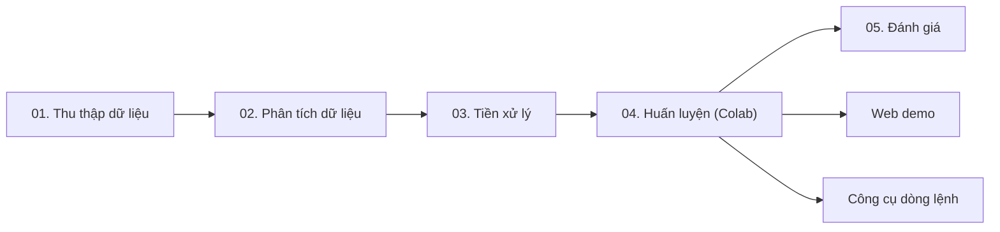
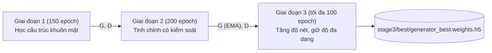
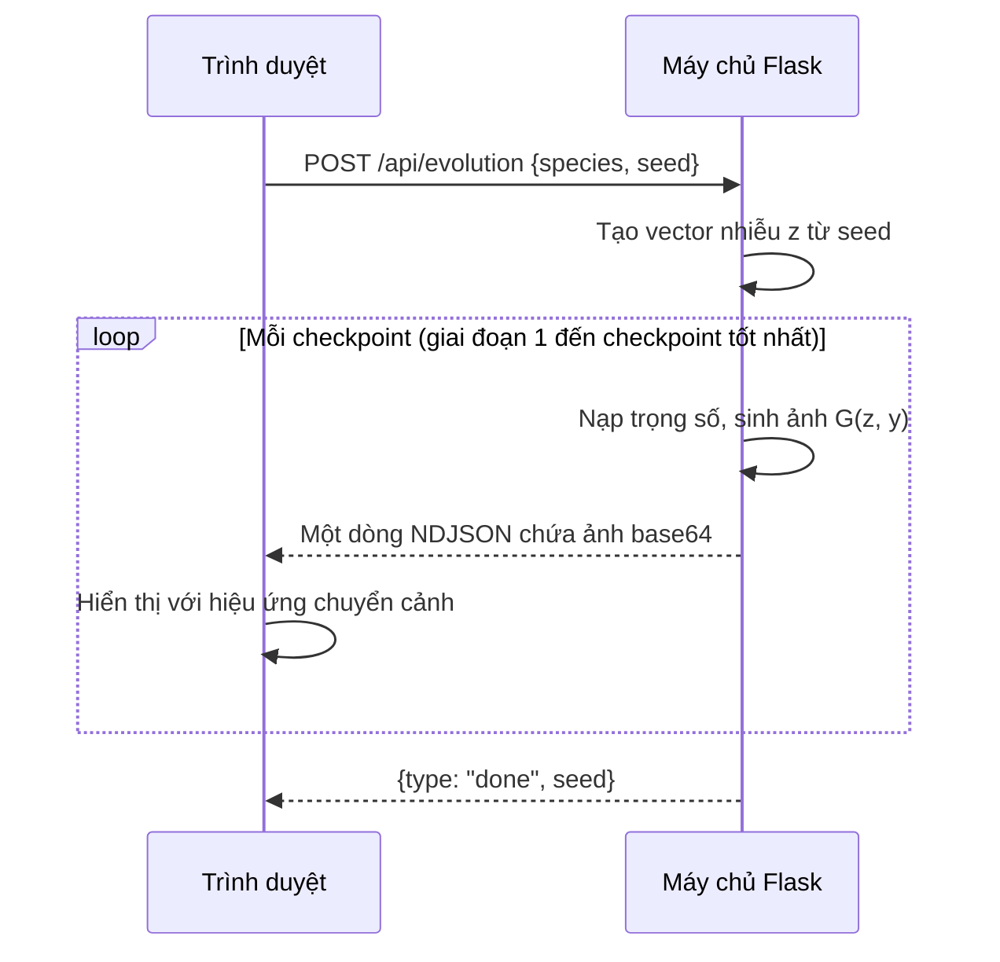

<div align="center">

# Dogs & Cats by GANs

**Sinh ảnh khuôn mặt chó và mèo kích thước 128×128 bằng Conditional DCGAN có kênh cạnh Sobel ở bộ phân biệt**


<sub>Hình 1. 32 ảnh do mô hình <code>sobelv5</code> sinh ra (giai đoạn 3, epoch 100, trọng số EMA). Hai hàng trên là chó, hai hàng dưới là mèo.</sub>

</div>

> [!NOTE]
> Đề tài được thực hiện với mục đích học tập: tìm hiểu cơ chế huấn luyện của mạng GAN có điều kiện, các hiện tượng thất bại thường gặp và các kỹ thuật ổn định quá trình huấn luyện. Đề tài không đặt mục tiêu tối ưu chất lượng ảnh hay so sánh với các mô hình sinh hiện đại.

---

## Khởi động nhanh

```bash
git clone --depth 1 https://github.com/peotrannnn/Dogs-and-cats-by-GANs.git
cd Dogs-and-cats-by-GANs
pip install -r requirements-web.txt

python scripts/gan.py generate --species both -n 8     # sinh 8 ảnh chó và 8 ảnh mèo vào thư mục outputs/
python scripts/gan.py serve                            # chạy web demo tại http://127.0.0.1:5000
```

---

## Mục lục

1. [Phát biểu bài toán](#1-phát-biểu-bài-toán)
2. [Thách thức](#2-thách-thức)
3. [Mục tiêu và phạm vi](#3-mục-tiêu-và-phạm-vi)
4. [Quy trình thực hiện và nội dung các notebook](#4-quy-trình-thực-hiện-và-nội-dung-các-notebook)
5. [Kiến trúc mô hình](#5-kiến-trúc-mô-hình)
6. [Huấn luyện ba giai đoạn](#6-huấn-luyện-ba-giai-đoạn)
7. [Theo dõi huấn luyện và chọn mô hình](#7-theo-dõi-huấn-luyện-và-chọn-mô-hình)
8. [Các thí nghiệm](#8-các-thí-nghiệm)
9. [Kết quả](#9-kết-quả)
10. [Công cụ dòng lệnh](#10-công-cụ-dòng-lệnh)
11. [Web demo](#11-web-demo)
12. [Tái lập toàn bộ quy trình](#12-tái-lập-toàn-bộ-quy-trình)
13. [Cấu trúc thư mục](#13-cấu-trúc-thư-mục)
14. [Hạn chế](#14-hạn-chế)
15. [Tài liệu tham khảo](#15-tài-liệu-tham-khảo)

---

## 1. Phát biểu bài toán

Mỗi mẫu dữ liệu gồm một ảnh khuôn mặt $x \in [-1, 1]^{128 \times 128 \times 3}$ và một nhãn loài $y \in \lbrace 0, 1 \rbrace$, trong đó $y = 0$ là chó và $y = 1$ là mèo. Ảnh thật tuân theo một phân phối có điều kiện chưa biết $p_{\text{data}}(x \mid y)$.

Bài toán đặt ra là học một bộ sinh (Generator)

```math
G_\theta : (z, y) \mapsto \hat{x} \in [-1, 1]^{128 \times 128 \times 3}, \qquad z \sim \mathcal{N}(0, I_{100})
```

sao cho với mỗi loài $y$, phân phối ảnh sinh $p_G(\hat{x} \mid y)$ xấp xỉ phân phối thật $p_{\text{data}}(x \mid y)$.

Bộ sinh được huấn luyện đối kháng với một bộ phân biệt (Discriminator) $D_\phi(x, y) \in \mathbb{R}$. Bộ phân biệt trả về logit và có nhiệm vụ phân biệt ảnh thật với ảnh sinh của cùng một loài. Hai mạng tối ưu bài toán minimax của Conditional GAN [2]:

```math
\min_{\theta} \max_{\phi} \quad \mathbb{E}_{(x, y) \sim p_{\text{data}}} \big[ \log \sigma(D_\phi(x, y)) \big] + \mathbb{E}_{z, y} \big[ \log \big( 1 - \sigma(D_\phi(G_\theta(z, y), y)) \big) \big]
```

Khi cài đặt, hàm mất mát của bộ sinh được thay bằng dạng non-saturating, kèm theo làm mềm nhãn và một số hạng chống sụp mode (mục 5.3).

| Thành phần | Mô tả |
|---|---|
| Đầu vào | Loài (`dog` hoặc `cat`) và một số `seed` dùng để tạo vector nhiễu $z$ |
| Đầu ra | Một ảnh RGB kích thước 128×128 |
| Dữ liệu | 9 950 ảnh huấn luyện, 866 ảnh kiểm định (AFHQ) |
| Tài nguyên | 1 GPU trên Google Colab, khoảng 37–40 giây mỗi epoch |

---

## 2. Thách thức

| Thách thức | Nguyên nhân | Biểu hiện trong đề tài |
|---|---|---|
| Sụp mode (mode collapse) | Bộ sinh tìm được một kiểu ảnh đánh lừa được bộ phân biệt và lặp lại kiểu ảnh đó | Thí nghiệm `default`: mọi vector nhiễu đều cho ra cùng một khuôn mặt ở mỗi loài |
| Bộ phân biệt áp đảo | Khi bộ phân biệt quá mạnh, gradient truyền về bộ sinh gần như không còn thông tin | Cuối giai đoạn 1, độ chính xác của bộ phân biệt đạt khoảng 0.97 |
| Đánh đổi giữa độ nét và độ ổn định | Instance noise và EMA giúp ổn định nhưng làm ảnh mờ; ép ảnh sắc nét dễ sinh nhiễu | Thí nghiệm `sobel_v2` cho ảnh vỡ thành các mảng vân lặp lại |
| Không có hàm mất mát đo chất lượng ảnh | Giá trị loss của hai mạng dao động và không phản ánh chất lượng ảnh | Cần xây dựng các chỉ số riêng: `struct`, `color`, `sharp` |
| Hai loài dùng chung một mạng | Chó và mèo chia sẻ trọng số nên chất lượng hai loài có thể chênh lệch | Phân tích dữ liệu cho thấy ảnh mèo có độ nét gấp khoảng hai lần ảnh chó |
| Giới hạn tài nguyên | Một lần huấn luyện đầy đủ kéo dài khoảng 5 giờ, phiên Colab có thể bị ngắt | Cần cơ chế lưu checkpoint, tiếp tục huấn luyện và lưu snapshot |

---

## 3. Mục tiêu và phạm vi

**Trong phạm vi đề tài**

- Xây dựng quy trình hoàn chỉnh và tái lập được: thu thập dữ liệu, phân tích, tiền xử lý, huấn luyện, đánh giá và demo.
- Sinh được ảnh nhận diện được loài, đa dạng và đúng với nhãn điều kiện.
- Khảo sát tác động của từng kỹ thuật: kênh phụ cho bộ phân biệt, TTUR, instance noise, DiffAugment, EMA và mode-seeking loss.
- Theo dõi được quá trình huấn luyện thông qua lưới ảnh sinh từ nhiễu cố định, các chỉ số tính riêng cho từng loài và hệ thống checkpoint.

**Ngoài phạm vi đề tài**

- Tối ưu FID/KID. Mã tính các chỉ số này có trong notebook 05 nhưng tắt theo mặc định.
- Sinh ảnh có độ chân thực như ảnh chụp.
- So sánh với StyleGAN hoặc các mô hình khuếch tán (diffusion).
- Tìm kiếm siêu tham số một cách hệ thống. Các giá trị trong đề tài được điều chỉnh thủ công qua từng lần thử.

---

## 4. Quy trình thực hiện và nội dung các notebook



Các notebook được viết song ngữ Anh–Việt theo cùng một cấu trúc: mục tiêu, ghi chú, mã nguồn, kết quả và tóm tắt. Mỗi notebook chỉ đọc dữ liệu từ các tệp manifest (CSV) do notebook trước tạo ra, không quét lại thư mục ảnh.

### 4.1. `01_download_data.ipynb`: thu thập dữ liệu

**Mục đích chính:** tạo một tập ảnh sạch có gắn nhãn loài, cùng một tệp manifest dùng làm nguồn tham chiếu cho các bước sau.

- Tải bộ dữ liệu `andrewmvd/animal-faces` (bản sao của AFHQ [8] trên Kaggle) bằng thư viện `kagglehub`. Dung lượng khoảng 696 MB, không cần đăng nhập.
- Giữ lại hai miền `dog` và `cat`, loại miền `wild`. Tệp ảnh được di chuyển và đổi tên theo dạng `dog_00000_...`, `cat_00000_...` để nhận biết loài từ tên tệp.
- Kiểm tra tính toàn vẹn từng ảnh bằng `PIL.Image.verify()`. Kết quả: 10 892/10 892 ảnh hợp lệ, cùng kích thước 512×512.
- Đầu ra gồm `data/raw/manifest.csv` (các cột `filepath`, `species`, `filesize_kb`, `width`, `height`, `is_valid`) và lưới ảnh mẫu `reports/figures/01_sample_grid.png`.

### 4.2. `02_eda.ipynb`: phân tích khám phá dữ liệu

**Mục đích chính:** xác định sự khác biệt giữa ảnh chó và ảnh mèo, đồng thời phát hiện các vấn đề chất lượng dữ liệu để làm căn cứ cho bước tiền xử lý.

Mỗi ảnh được đọc một lần để trích xuất năm đặc trưng: độ sáng, độ nét (phương sai của toán tử Laplacian), màu trung bình theo kênh RGB, mật độ cạnh Canny và mã băm cảm nhận (perceptual hash).

| Nội dung phân tích | Kết quả |
|---|---|
| Cân bằng lớp | 48.1 % chó, 51.9 % mèo; không cần đánh trọng số theo lớp |
| Độ sáng | Tương đương giữa hai loài (trung bình khoảng 118/255) |
| Độ nét (trung vị) | Mèo 988, chó 475; ảnh mèo nét gấp khoảng hai lần |
| Mật độ cạnh Canny (trung vị) | Mèo 0.084, chó 0.053; ảnh mèo có nhiều chi tiết lông và ria hơn |
| Kết cấu LBP (mẫu 2 000 ảnh) | Entropy của mèo cao hơn không đáng kể (3.12 so với 3.08) |
| Ảnh trùng lặp | 5 nhóm trùng hoàn toàn và 75 cặp gần trùng (khoảng cách Hamming ≤ 5), trong đó 60/75 cặp thuộc lớp mèo |
| PCA trên 6 đặc trưng | Hai thành phần đầu giải thích 89.7 % phương sai. Hai loài chồng lấn phần lớn, chỉ lớp mèo phân tán rộng hơn theo PC2. Các đặc trưng cấp thấp không đủ để phân biệt loài, vì vậy mô hình cần nhận nhãn loài làm điều kiện |
| Ảnh ngoại lai | Chỉ một ảnh thực sự hỏng (khung hình gần như đen hoàn toàn); các ảnh ngoại lai còn lại là ảnh hợp lệ |

<p align="center"><br><sub>Hình 2. Ảnh trung bình của mỗi loài. Khuôn mặt được căn giữa đồng đều, thuận lợi cho một mạng DCGAN có kích thước nhỏ.</sub></p>

Các đặc trưng Canny và LBP không khả vi nên chỉ được dùng trong bước phân tích. Trong quá trình huấn luyện, bộ phân biệt sử dụng toán tử Sobel hoặc Laplacian vì hai toán tử này khả vi.

### 4.3. `03_preprocessing_128.ipynb` và `03_preprocessing_64.ipynb`: tiền xử lý

**Mục đích chính:** chuyển các kết quả phân tích thành những quy tắc lọc dữ liệu có căn cứ, sau đó xuất tập dữ liệu sẵn sàng cho huấn luyện.

1. **Loại ảnh hỏng.** Một ảnh chỉ bị loại khi đồng thời thỏa `gray_std < 10` và `blur_var < 50`. Quy tắc kép này giữ lại các ảnh mờ nhưng hợp lệ. Có 1 ảnh bị loại.
2. **Loại ảnh trùng lặp.** So sánh mã băm cảm nhận trong cùng một loài với ngưỡng Hamming ≤ 5, gom nhóm bằng cấu trúc Union-Find (xử lý được chuỗi A ≈ B ≈ C) và giữ lại ảnh có độ nét cao nhất trong mỗi nhóm. Có 75 ảnh bị loại.
3. **Chia tập huấn luyện và kiểm định** theo tỷ lệ 92/8, phân tầng theo loài, `seed = 42`. Tập kiểm định có kích thước nhỏ vì chỉ dùng để so sánh chỉ số giữa ảnh thật và ảnh sinh, không dùng để chọn mô hình.
4. **Thay đổi kích thước** từ 512×512 xuống 128×128 bằng nội suy `cv2.INTER_AREA` nhằm hạn chế hiện tượng răng cưa.
5. **Chuẩn hóa** giá trị điểm ảnh về $[-1, 1]$ cho khớp với hàm kích hoạt `tanh` ở đầu ra bộ sinh. Việc chuẩn hóa được thực hiện khi nạp dữ liệu; ảnh trên đĩa vẫn lưu ở dạng 8 bit. Notebook có kiểm tra phép biến đổi ngược cho kết quả trùng khớp hoàn toàn.
6. **Tăng cường dữ liệu** chỉ gồm lật ngang ngẫu nhiên, thực hiện khi huấn luyện. Lật dọc và xoay không được sử dụng vì làm sai cấu trúc giải phẫu của khuôn mặt.

| | Chó | Mèo | Tổng |
|---|---:|---:|---:|
| Ảnh ban đầu | 5 239 | 5 653 | 10 892 |
| Loại do hỏng | 0 | 1 | 1 |
| Loại do trùng lặp | 15 | 60 | 75 |
| Tập huấn luyện | 4 806 | 5 144 | 9 950 |
| Tập kiểm định | 418 | 448 | 866 |

Đầu ra gồm thư mục `data/processed/images_128/` cùng các tệp `train_manifest.csv`, `val_manifest.csv` và `removed_images_log.csv`. Phiên bản `_64` thực hiện các bước tương tự cho ảnh 64×64 và ghi ra các tệp có hậu tố `_64`.

### 4.4. `04_model_training_5th_attempt.ipynb`: huấn luyện mô hình `sobelv5`

**Mục đích chính:** huấn luyện một kiến trúc duy nhất qua ba giai đoạn, mỗi giai đoạn giải quyết một nhiệm vụ riêng, kèm theo hệ thống theo dõi và lưu checkpoint đủ tin cậy để không mất kết quả khi phiên làm việc bị ngắt.

Notebook chạy trên Google Colab, dữ liệu và kết quả lưu tại `MyDrive/dog-gan-project`. Ảnh được sao chép vào ổ đĩa cục bộ của máy ảo để tăng tốc độ đọc. Nội dung chính:

- Đường ống dữ liệu `tf.data`: đọc ảnh, chuẩn hóa, lật ngang, chia batch 128 và nạp trước (prefetch).
- Kênh Sobel và kênh loài làm đầu vào bổ sung cho bộ phân biệt (mục 5.2).
- Định nghĩa kiến trúc, hàm mất mát và các kỹ thuật ổn định (mục 5).
- Hàm `make_train_step()` tạo một `tf.function` riêng cho từng giai đoạn, với các tùy chọn (instance noise, DiffAugment, mode-seeking) được cố định khi biên dịch.
- Các chỉ số theo dõi, lưới ảnh kích thước 1920×1080 (ghép trực tiếp thành video được) và hệ thống checkpoint ba tầng.
- Hàm `run_stage()` thực thi một giai đoạn bất kỳ: tự tiếp tục từ checkpoint, tự nạp trọng số của giai đoạn trước và áp dụng quy tắc dừng sớm.
- Tổng hợp tệp `history.csv` của cả ba giai đoạn thành một chuỗi thời gian duy nhất.

### 4.5. `04_model_training_kinkySobel.ipynb`: phiên bản 64×64

Notebook áp dụng cùng quy trình với `sobelv5` cho ảnh 64×64: bộ sinh bớt một lớp tích chập chuyển vị, bộ phân biệt bớt một lớp tích chập. Ngoài các checkpoint thông thường, notebook còn lưu thêm trọng số tại các epoch 1, 3, 5, 10, 15, 25, 50, 100 và 150 vào thư mục `web_progression/` kèm tệp `manifest.json`, nhằm phục vụ minh họa quá trình học từ những epoch đầu tiên. Kết quả của phiên bản này chưa được đưa vào kho mã.

### 4.6. `05_evaluation_report.ipynb`: đánh giá mô hình

**Mục đích chính:** đánh giá mô hình đã huấn luyện trên máy cục bộ mà không huấn luyện lại, và đảm bảo kết quả tái lập được.

- Tự động tìm thư mục mô hình, lập danh sách checkpoint và chọn theo thứ tự ưu tiên (`stage3/best`, sau đó đến EMA, …).
- Tổng hợp `history.csv` và `best_info.json` thành bảng tóm tắt theo từng giai đoạn.
- Sinh lưới 16 ảnh chó và 16 ảnh mèo từ nhiễu cố định để đánh giá trực quan: hình dạng mắt, mũi, tai; bộ phận bị lặp; dấu hiệu sụp mode.
- Tính `struct`, `color`, `sharp` của ảnh sinh và so sánh với ảnh thật trong tập kiểm định.
- So sánh checkpoint tốt nhất của ba giai đoạn trên cùng một tập vector nhiễu.
- Tính FID/KID bằng InceptionV3 (tùy chọn, bật bằng `RUN_INCEPTION_METRICS = True`).
- Sinh 64 ảnh mỗi loài có đánh số và lưu các vector nhiễu vào `seed_bank_latents.npz`, cho phép tái tạo chính xác từng ảnh.
- Đầu ra lưu tại `notebooks/evaluation/sobelv5/` (`figures/`, `tables/`, `evaluation_summary.json`).

---

## 5. Kiến trúc mô hình

### 5.1. Bộ sinh (khoảng 3.21 triệu tham số)

```text
z (100) ------------------+
                          +-- concat (150) -> Dense 8*8*256 -> BN -> LeakyReLU(0.2) -> reshape 8x8x256
y -> Embedding(2, 50) ----+
    -> ConvTranspose(128, k=4, s=2) -> BN -> LeakyReLU      16x16x128
    -> ConvTranspose( 64, k=4, s=2) -> BN -> LeakyReLU      32x32x64
    -> ConvTranspose( 32, k=4, s=2) -> BN -> LeakyReLU      64x64x32
    -> ConvTranspose(  3, k=4, s=2) -> tanh                128x128x3
```

### 5.2. Bộ phân biệt (khoảng 2.79 triệu tham số)

Đầu vào của bộ phân biệt gồm năm kênh: ảnh RGB, kênh loài và kênh cạnh Sobel.

```math
\mathrm{input}_D = \big[ x \;\Vert\; c(y) \;\Vert\; S(x) \big] \in \mathbb{R}^{128 \times 128 \times 5}, \qquad c(y) = (2y - 1) \cdot \mathbf{1}_{128 \times 128}
```

- $c(y)$ là một ảnh hằng, nhận giá trị −1 với chó và +1 với mèo. Kênh này cho phép bộ phân biệt đánh giá ảnh có phải là một con mèo thật hay không, chứ không chỉ là một con vật thật.
- $S(x)$ là độ lớn gradient Sobel của ảnh xám, được chuẩn hóa min–max về $[-1, 1]$ cho từng ảnh. Phép tính nằm trong mô hình nên khả vi. Kênh này cung cấp trực tiếp thông tin về đường biên, qua đó thúc đẩy bộ sinh tạo ra các cạnh rõ nét thay vì các vùng màu nhòe.

```text
128x128x5 -> Conv 64  (k=4, s=2) -> LeakyReLU -> Dropout 0.3           64x64
          -> Conv 128            -> BN -> LeakyReLU -> Dropout 0.3     32x32
          -> Conv 256            -> BN -> LeakyReLU                    16x16
          -> Conv 512            -> BN -> LeakyReLU                     8x8
          -> Flatten -> Dense(1)  (logit)
```

Bộ phân biệt không sử dụng Spectral Normalization hay minibatch standard deviation. Việc kiềm chế bộ phân biệt được thực hiện hoàn toàn ở phía huấn luyện, nhờ đó kiến trúc được giữ nguyên qua cả ba giai đoạn và trọng số có thể chuyển tiếp giữa các giai đoạn.

### 5.3. Hàm mất mát

Gọi $\hat{x} = G(z, y)$ là ảnh sinh và $T(\cdot)$ là phép biến đổi áp dụng như nhau cho ảnh thật và ảnh sinh trước khi đưa vào bộ phân biệt (instance noise, DiffAugment).

Hàm mất mát của bộ phân biệt sử dụng làm mềm nhãn một phía (nhãn thật bằng 0.9):

```math
\mathcal{L}_D = \mathrm{BCE}\big(0.9,\ D(T(x), y)\big) + \mathrm{BCE}\big(0,\ D(T(\hat{x}), y)\big)
```

Hàm mất mát của bộ sinh gồm thành phần non-saturating và số hạng mode-seeking (chỉ bật ở giai đoạn 3):

```math
\mathcal{L}_G = \mathrm{BCE}\big(1,\ D(T(\hat{x}), y)\big) - \lambda_{ms} \, \mathcal{L}_{ms}
```

Để tính số hạng mode-seeking [6], batch được sắp xếp sao cho mẫu thứ $i$ và mẫu thứ $i + B/2$ có cùng loài nhưng khác vector nhiễu:

```math
\mathcal{L}_{ms} = \frac{2}{B} \sum_{i=1}^{B/2} \frac{\mathrm{mean} \left| G(z_i, y_i) - G(z_{i+B/2}, y_i) \right|}{\mathrm{mean} \left| z_i - z_{i+B/2} \right| + \epsilon}
```

Số hạng này khuyến khích các vector nhiễu khác nhau cho ra các ảnh khác nhau. Nếu nhiều vector nhiễu cùng cho một khuôn mặt thì $\mathcal{L}_{ms}$ tiến về 0, và gradient sẽ đẩy bộ sinh ra khỏi trạng thái đó. Cả hai mạng dùng bộ tối ưu Adam với $\beta_1 = 0.5$.

### 5.4. Các kỹ thuật ổn định huấn luyện

| Kỹ thuật | Cách thực hiện | Mục đích |
|---|---|---|
| TTUR [4] | Tốc độ học của bộ phân biệt nhỏ hơn bộ sinh (giai đoạn 2: bằng một phần ba) | Kiềm chế bộ phân biệt |
| Instance noise [5] | Cộng nhiễu Gauss vào đầu vào của bộ phân biệt, độ lệch chuẩn giảm tuyến tính về 0 trong 60 % đầu giai đoạn | Làm mềm biên quyết định của bộ phân biệt |
| DiffAugment [7] | Dịch chuyển ngẫu nhiên tối đa 1/8 kích thước ảnh, áp dụng cho cả ảnh thật và ảnh sinh | Tránh bộ phân biệt ghi nhớ tập dữ liệu thật; phép biến đổi không lọt vào ảnh sinh |
| EMA của bộ sinh | Duy trì bản trung bình trượt của trọng số, cập nhật mỗi epoch | Tạo bản bộ sinh ổn định hơn, dùng để sinh ảnh và xuất mô hình |
| Lịch tốc độ học | Giữ nguyên đến một tỷ lệ $a$ của giai đoạn, sau đó giảm tuyến tính đến $\rho$ lần giá trị ban đầu | Tinh chỉnh ở cuối giai đoạn |
| Làm mềm nhãn | Nhãn của ảnh thật bằng 0.9 | Giảm mức tự tin quá cao của bộ phân biệt |

Công thức của instance noise, EMA và lịch tốc độ học ($e$ là epoch hiện tại, $E$ là số epoch của giai đoạn):

```math
\sigma(e) = \sigma_0 \max\left(0,\ 1 - \frac{e - 1}{0.6E}\right), \qquad
\theta_{\mathrm{EMA}} \leftarrow \beta \, \theta_{\mathrm{EMA}} + (1 - \beta) \, \theta, \qquad
\eta(e) = \eta_0 \cdot \begin{cases} 1 & e \le aE \\ 1 - \dfrac{e - aE}{E - aE} (1 - \rho) & e > aE \end{cases}
```

Các kỹ thuật trên chỉ tác động trong quá trình huấn luyện; ảnh sinh ra để lưu trữ hoặc hiển thị không qua bất kỳ phép tăng cường nào.

---

## 6. Huấn luyện ba giai đoạn



| Tham số | Giai đoạn 1 | Giai đoạn 2 | Giai đoạn 3 |
|---|:---:|:---:|:---:|
| Nhiệm vụ | Học nhanh cấu trúc khuôn mặt | Tinh chỉnh chậm, ổn định | Tăng độ nét, duy trì độ đa dạng |
| Số epoch | 150 | 200 | tối đa 100 |
| Tốc độ học G / D | `2e-4` / `2e-4` | `1.5e-4` / `5e-5` | `5e-5` / `2.5e-5` |
| Instance noise ban đầu | không | 0.05, giảm về 0 | không |
| DiffAugment | không | translation | translation |
| Hệ số EMA | không | 0.95 | 0.90 |
| Trọng số mode-seeking | 0 | 0 | 0.2 |
| Bắt đầu giảm tốc độ học / mức sàn | không giảm | 70 % / 0.4 | 30 % / 0.3 |
| Chu kỳ lưu snapshot | 25 epoch | 25 epoch | 10 epoch |
| Dừng sớm khi sụp mode | không | không | có |
| Khởi tạo | ngẫu nhiên | G và D của giai đoạn 1 | G (EMA) và D của giai đoạn 2 |

**Tham số chung:** `IMAGE_SIZE = 128`, `NOISE_DIM = 100`, `EMBEDDING_DIM = 50`, `BATCH_SIZE = 128` (khoảng 77 bước mỗi epoch), `CHECKPOINT_EVERY = 5`, `REAL_LABEL_SMOOTHING = 0.9`, `RANDOM_SEED = 42`, `HEALTH_TARGET = 0.85`, `COLLAPSE_STOP_RATIO = 0.60`, `COLLAPSE_PATIENCE = 2`.

**Lý do chia ba giai đoạn**

- Giai đoạn 1 sử dụng cấu hình DCGAN cơ bản vì cấu hình này học cấu trúc khuôn mặt nhanh nhất: lớp mèo hội tụ quanh epoch 100–120, lớp chó quanh epoch 150. Giai đoạn kết thúc ở epoch 150, trước khi bộ phân biệt áp đảo hoàn toàn (độ chính xác đang tăng dần về 0.95).
- Giai đoạn 2 nạp cả bộ sinh và bộ phân biệt từ giai đoạn 1. Nếu khởi tạo lại bộ phân biệt, những gì bộ sinh đã học sẽ bị phá vỡ chỉ sau vài trăm bước. Tốc độ học của bộ phân biệt được giảm còn một phần ba so với bộ sinh. Thời lượng 200 epoch đủ để instance noise giảm dần, và tốc độ học chỉ bắt đầu giảm từ epoch 140.
- Giai đoạn 3 tắt instance noise vì nhiễu có xu hướng duy trì ảnh mờ. Trọng số mode-seeking 0.2 đủ để chống sụp mode mà không lấn át mục tiêu tăng độ nét. Mức sàn tốc độ học 0.3 giữ lại một phần tín hiệu học đến cuối giai đoạn.
- Các mốc của lịch tốc độ học được tính theo tỷ lệ độ dài giai đoạn, nên khi thay đổi số epoch thì các mốc này tự điều chỉnh theo.

**Các loại trọng số được lưu trong mỗi giai đoạn**

| Loại | Tệp | Thời điểm lưu | Công dụng |
|---|---|---|---|
| Checkpoint luân phiên | `generator.weights.h5`, `discriminator.weights.h5`, `generator_ema.weights.h5` | Mỗi 5 epoch, ghi đè | Tiếp tục huấn luyện khi phiên bị ngắt |
| Snapshot | `snapshots/generator[_ema]_eXXX.weights.h5` | Mỗi 25 hoặc 10 epoch, không ghi đè | Quay lại phiên bản trước; minh họa quá trình học |
| Mô hình tốt nhất | `best/generator_best.weights.h5` và `best_info.json` | Khi điểm đánh giá tăng | Xuất mô hình, demo |

Ngoài ra, tệp `history.csv` ghi lại một dòng cho mỗi epoch, gồm: loss, độ chính xác của bộ phân biệt, giá trị mode-seeking, điểm đánh giá, `health`, tỷ lệ độ nét, tốc độ học, mức nhiễu và các chỉ số `struct`, `color`, `sharp` của từng loài.

---

## 7. Theo dõi huấn luyện và chọn mô hình

Do giá trị loss không phản ánh chất lượng ảnh, sau mỗi epoch notebook tính ba chỉ số cho từng loài trên 64 vector nhiễu cố định và so sánh với cùng chỉ số trên ảnh thật.

| Chỉ số | Định nghĩa | Hiện tượng phát hiện được |
|---|---|---|
| `struct` | 1 trừ hệ số tương quan trung bình giữa các cặp ảnh (ảnh xám 32×32, chuẩn hóa từng ảnh nên loại bỏ ảnh hưởng của màu và độ sáng) | Sụp mode: khi các ảnh giống nhau, `struct` tiến về 0 |
| `color` | Độ lệch chuẩn của màu trung bình giữa các ảnh | Các ảnh bị giới hạn trong một dải màu hẹp |
| `sharp` | Trung bình độ lớn gradient Sobel | Ảnh bị mờ |

Checkpoint tốt nhất được chọn theo điểm tổng hợp:

```math
r_{\mathrm{sharp}} = \min\left(1,\ \frac{\sum_y \mathrm{sharp}_G(y)}{\sum_y \mathrm{sharp}_{\mathrm{real}}(y)}\right), \qquad
h = \min_y \frac{\mathrm{struct}_G(y)}{\mathrm{struct}_{\mathrm{real}}(y)}, \qquad
\mathrm{score} = r_{\mathrm{sharp}} \cdot \min\left(1,\ \frac{h}{0.85}\right)
```

Theo công thức trên, mô hình tốt nhất là mô hình có độ nét cao nhất trong số các mô hình còn giữ được độ đa dạng. Việc tăng độ nét vượt mức ảnh thật không được cộng điểm, còn mô hình nét nhưng bị sụp mode sẽ bị trừ điểm. Ở giai đoạn 3, quá trình huấn luyện dừng sớm nếu $h < 0.60$ trong hai lần kiểm tra liên tiếp. Notebook cũng đưa ra cảnh báo khi độ chính xác của bộ phân biệt vượt 0.95 hoặc thấp hơn 0.55.

Các chỉ số trên chỉ mang tính tham khảo. Việc đánh giá cuối cùng vẫn dựa trên quan sát lưới ảnh trong `reports/figures/04_training/`.

---

## 8. Các thí nghiệm

Lưới ảnh sinh (lưu mỗi 5 epoch) của các lần chạy được lưu tại `reports/figures/04_training/`, video tương ứng tại [`reports/figures/videos/`](reports/figures/videos).

| STT | Tên | Thay đổi chính | Số epoch | Nhận xét | Tư liệu |
|:-:|---|---|---|---|---|
| 1 | `default` | Bộ phân biệt nhận RGB và kênh loài | 335 | Sụp mode: mỗi loài chỉ sinh ra một khuôn mặt | [Ảnh](reports/figures/04_training/default/epoch_335.png) · [Video](reports/figures/videos/default.mp4) |
| 2 | `laplacian` | Thêm kênh Laplacian cho bộ phân biệt | 300 | Đa dạng, ảnh còn mờ | [Ảnh](reports/figures/04_training/laplacian/epoch_300.png) · [Video](reports/figures/videos/laplacian.mp4) |
| 3 | `sobel` | Thêm kênh Sobel cho bộ phân biệt | 300 | Đa dạng, đường biên rõ hơn; kênh Sobel được chọn cho các bước tiếp theo | [Ảnh](reports/figures/04_training/sobel/epoch_300.png) · [Video](reports/figures/videos/sobel.mp4) |
| 4 | `sobel_v2` | Biến thể của cấu hình Sobel | 155 | Thất bại: ảnh vỡ thành các mảng vân lặp lại | [Ảnh](reports/figures/04_training/sobel_v2/epoch_155.png) · [Video](reports/figures/videos/sobel_v2.mp4) |
| 5 | `sobelv3` | Huấn luyện một giai đoạn kéo dài | 300 | Nhận diện được loài nhưng còn nhiều nhiễu | [Ảnh](reports/figures/04_training/sobelv3/epoch_300.png) · [Video](reports/figures/videos/sobelv3.mp4) |
| 6 | `sobelv4` | Lần đầu áp dụng huấn luyện ba giai đoạn | 150 + 100 + 80 | Độ nét và độ đa dạng cải thiện rõ | [Ảnh](reports/figures/04_training/sobelv4/stage3/epoch_080.png) · [Video](reports/figures/videos/sobelv4.mp4) |
| 7 | `sobelv5` | Ba giai đoạn, kéo dài giai đoạn 2 lên 200 epoch | 150 + 200 + 100 | Mô hình cuối cùng | [Ảnh](reports/figures/04_training/sobelv5/stage3/epoch_100.png) · [Video](reports/figures/videos/sobelv5.mp4) |
| – | `kinkySobel` | Phiên bản 64×64 của `sobelv5` | – | Chưa có kết quả trong kho mã | – |

Thí nghiệm 1 đến 3 là thí nghiệm loại bỏ (ablation) đối với kênh phụ của bộ phân biệt. Hiện chỉ `sobelv5` và `kinkySobel` còn lưu notebook huấn luyện; thông tin về các thí nghiệm 1 đến 6 được tổng hợp từ lưới ảnh đã lưu.

<table>
<tr>
<td align="center"><br><sub>Hình 3a. <code>default</code>: sụp mode, các mẫu có cùng khuôn mặt</sub></td>
<td align="center"><br><sub>Hình 3b. <code>sobel</code>: bổ sung kênh Sobel cho bộ phân biệt</sub></td>
</tr>
</table>

---

## 9. Kết quả

**So sánh với ảnh thật trong tập kiểm định** (checkpoint `stage3/best`, 64 ảnh mỗi loài):

| Loài | `struct` (sinh / thật) | `color` (sinh / thật) | `sharp` (sinh / thật) |
|---|:---:|:---:|:---:|
| Chó | 0.931 / 0.953 (tỷ lệ 0.98) | 0.214 / 0.235 (tỷ lệ 0.91) | 0.306 / 0.310 (tỷ lệ 0.99) |
| Mèo | 0.945 / 0.981 (tỷ lệ 0.96) | 0.218 / 0.203 (tỷ lệ 1.07) | 0.324 / 0.343 (tỷ lệ 0.95) |

**Checkpoint tốt nhất của từng giai đoạn** (`models/sobelv5/stage*/best/best_info.json`):

| Giai đoạn | Epoch tốt nhất | Điểm | Health | Độ chính xác D cuối giai đoạn |
|---|:---:|:---:|:---:|:---:|
| 1 | 60 | 1.000 | 0.859 | 0.973 |
| 2 | 200 | 0.993 | 0.937 | 0.860 |
| 3 | 5 | 1.000 | 0.936 | 0.926 |

<table>
<tr>
<td align="center"><br><sub>Giai đoạn 1</sub></td>
<td align="center"><br><sub>Giai đoạn 2</sub></td>
<td align="center"><br><sub>Giai đoạn 3</sub></td>
</tr>
</table>
<p align="center"><sub>Hình 4. Ảnh sinh từ cùng 8 vector nhiễu qua checkpoint tốt nhất của ba giai đoạn. Giai đoạn 1 hình thành cấu trúc khuôn mặt; giai đoạn 2 và 3 giảm nhiễu và làm rõ chi tiết.</sub></p>

**Nhận xét**

- Độ đa dạng và độ nét của ảnh sinh đạt khoảng 95–99 % so với ảnh thật, không có dấu hiệu sụp mode.
- TTUR ở giai đoạn 2 làm độ chính xác của bộ phân biệt giảm từ 0.97 xuống 0.86, cho thấy bộ phân biệt đã được kiềm chế như thiết kế.
- Về mặt trực quan, phần lớn ảnh sinh nhận diện được loài. Tuy nhiên vẫn còn các lỗi như mắt lệch, khuôn mặt biến dạng hoặc vùng lông thiếu tự nhiên. Kết quả này phù hợp với mục tiêu học tập của đề tài.

---

## 10. Công cụ dòng lệnh

Tệp `scripts/gan.py` cung cấp các lệnh sử dụng mô hình mà không cần mở notebook. Các lệnh được chạy từ thư mục gốc của dự án; ảnh đầu ra được lưu vào `outputs/` (đã khai báo trong `.gitignore`).

| Lệnh | Chức năng | Cần TensorFlow |
|---|---|:---:|
| `info` | Liệt kê checkpoint, dữ liệu và thư viện hiện có | Không |
| `generate` | Sinh lưới ảnh chó, mèo hoặc cả hai | Có |
| `evolution` | Sinh ảnh từ cùng một vector nhiễu qua các checkpoint để minh họa quá trình học; có thể xuất GIF | Có |
| `interpolate` | Nội suy tuyến tính giữa các vector nhiễu | Có |
| `history` | Vẽ biểu đồ loss và các chỉ số của ba giai đoạn từ `history.csv` | Không |
| `serve` | Khởi động web demo | Có |

```bash
# Kiểm tra môi trường
python scripts/gan.py info

# Sinh ảnh
python scripts/gan.py generate                                   # 8 ảnh chó và 8 ảnh mèo, seed 42
python scripts/gan.py generate --species cat -n 16 --seed 7 --upscale 2 --labels
python scripts/gan.py generate --species dog -n 4 --separate     # lưu thêm từng ảnh riêng
python scripts/gan.py generate --ckpt stage1                     # dùng checkpoint tốt nhất của giai đoạn 1
python scripts/gan.py generate --ckpt stage2:e150                # dùng snapshot (nếu có)

# Minh họa quá trình học (mỗi seed một hàng)
python scripts/gan.py evolution --species cat --seeds 1 2 3 --gif

# Nội suy trong không gian ẩn
python scripts/gan.py interpolate --species dog --seeds 10 20 30 --steps 6

# Biểu đồ huấn luyện
python scripts/gan.py history

# Xem đầy đủ tham số của một lệnh
python scripts/gan.py generate -h
```

Tham số `--seed` dùng cùng quy ước với web demo (`numpy.random.default_rng(seed)`), do đó cùng một seed và cùng một loài sẽ cho cùng một ảnh trên cả hai công cụ.

Sinh ảnh trực tiếp bằng Python:

```python
import numpy as np
from PIL import Image
from src.generator import build_generator, latent_from_seed, to_uint8

G = build_generator()
G.load_weights("models/sobelv5/stage3/best/generator_best.weights.h5")

z = latent_from_seed(42, n=8)                 # (8, 100)
y = np.full(8, 1, dtype="int32")              # 0: chó, 1: mèo
imgs = to_uint8(G([z, y], training=False))    # (8, 128, 128, 3), uint8
Image.fromarray(np.hstack(imgs)).save("cats.png")
```

---

## 11. Web demo

```bash
pip install -r requirements-web.txt     # flask, numpy, pillow, tensorflow
python src/web_server.py                # hoặc: python scripts/gan.py serve
```

Sau khi khởi động, truy cập <http://127.0.0.1:5000>, chọn Dog hoặc Cat và nhấn Generate.



- Một vector nhiễu duy nhất được đưa qua lần lượt các checkpoint, cho phép quan sát cùng một khuôn mặt hình thành theo quá trình huấn luyện.
- Máy chủ dùng lại một đối tượng bộ sinh và chỉ thay trọng số ở mỗi bước, tiết kiệm bộ nhớ so với nạp nhiều mô hình.
- `GET /api/health` trả về danh sách checkpoint đang sử dụng.
- Gọi API trực tiếp:

  ```bash
  curl -X POST http://127.0.0.1:5000/api/evolution -H "Content-Type: application/json" -d "{\"species\": \"cat\", \"seed\": 1234}"
  ```

> [!IMPORTANT]
> Thư mục `snapshots/` không được đưa lên kho mã do dung lượng lớn. Vì vậy khi tải mã từ GitHub, chỉ có các tệp trong `stage*/best/`, và web demo chỉ hiển thị ảnh của `stage3/best`. Để xem đầy đủ quá trình học, cần chép các tệp `generator_eXXX.weights.h5` và `generator_ema_eXXX.weights.h5` vào `models/sobelv5/stage{1,2,3}/snapshots/`. Lệnh `python scripts/gan.py evolution` vẫn hoạt động khi không có snapshot bằng cách sử dụng checkpoint tốt nhất của ba giai đoạn.

---

## 12. Tái lập toàn bộ quy trình

| Bước | Notebook | Môi trường | Đầu ra |
|:-:|---|---|---|
| 1 | `01_download_data` | Máy cục bộ | `data/raw/images/`, `manifest.csv` |
| 2 | `02_eda` | Máy cục bộ | `reports/figures/02_eda/` |
| 3 | `03_preprocessing_128` (hoặc `_64`) | Máy cục bộ | `data/processed/images_128/` và các tệp manifest |
| 4 | `04_model_training_5th_attempt` | Google Colab (GPU) | `models/sobelv5/`, lưới ảnh huấn luyện |
| 5 | `05_evaluation_report` | Máy cục bộ | `notebooks/evaluation/sobelv5/` |

```bash
python -m venv .venv
.venv\Scripts\activate                 # Windows (macOS/Linux: source .venv/bin/activate)
pip install -r requirements.txt        # thư viện cho notebook 01–03
jupyter notebook notebooks/
```

1. Chạy lần lượt các notebook 01, 02 và 03 trên máy cục bộ (cần khoảng 2 GB dung lượng trống).
2. Tải thư mục `data/processed/` lên Google Drive tại `MyDrive/dog-gan-project/data/processed/`.
3. Mở notebook 04 trên Colab, chọn GPU tại *Runtime → Change runtime type*, rồi chạy lần lượt ba giai đoạn. Nếu phiên bị ngắt, chạy lại ô lệnh của giai đoạn tương ứng; notebook sẽ tiếp tục từ checkpoint gần nhất.
4. Tải thư mục `models/sobelv5/` về máy và chạy notebook 05. Để tính FID/KID, đặt `RUN_INCEPTION_METRICS = True`.

---

## 13. Cấu trúc thư mục

```text
Dogs-and-cats-by-GANs/
├── data/processed/               manifest tập huấn luyện/kiểm định, nhật ký ảnh bị loại
├── models/sobelv5/stage{1,2,3}/
│   ├── history.csv               nhật ký theo epoch
│   └── best/                     generator_best.weights.h5, best_info.json
├── notebooks/
│   ├── 01_download_data.ipynb
│   ├── 02_eda.ipynb
│   ├── 03_preprocessing_128.ipynb, 03_preprocessing_64.ipynb
│   ├── 04_model_training_5th_attempt.ipynb, 04_model_training_kinkySobel.ipynb
│   ├── 05_evaluation_report.ipynb
│   └── evaluation/sobelv5/       figures/, tables/, evaluation_summary.json
├── reports/figures/
│   ├── 02_eda/, 03_preprocessing/, 03_preprocessing_64/
│   ├── 04_training/<thí nghiệm>/epoch_XXX.png
│   └── videos/<thí nghiệm>.mp4
├── scripts/gan.py                công cụ dòng lệnh
├── src/
│   ├── generator.py              kiến trúc bộ sinh và các hàm tiện ích
│   └── web_server.py             máy chủ Flask cho web demo
├── web/                          index.html, style.css, script.js
├── requirements.txt              thư viện cho notebook 01–03
├── requirements-web.txt          thư viện cho web demo và công cụ dòng lệnh
└── LICENSE
```

---

## 14. Hạn chế

- **Điểm đánh giá bị bão hòa.** Hai thành phần $r_{\mathrm{sharp}}$ và $h / 0.85$ đều bị chặn trên bởi 1, và checkpoint tốt nhất chỉ được cập nhật khi điểm tăng thực sự. Vì vậy checkpoint tốt nhất của giai đoạn 3 là epoch 5, lần đầu điểm đạt 1.0, dù các epoch sau có thể tốt tương đương. Có thể khắc phục bằng cách dùng `health` làm tiêu chí phụ khi điểm bằng nhau, hoặc bỏ giới hạn trên.
- Các chỉ số `struct`, `color`, `sharp` chỉ phản ánh thống kê cấp thấp, không đánh giá được tính đúng đắn về giải phẫu (số mắt, vị trí mũi, …).
- Bản tải từ GitHub không có snapshot (xem mục 11).
- Cấu hình chi tiết của các thí nghiệm `default` đến `sobelv4` không còn notebook đi kèm.
- Notebook 04 có đề cập `06_export_model.ipynb`, nhưng notebook này chưa được xây dựng.
- Web demo yêu cầu Python và TensorFlow. Để chạy trên GitHub Pages, cần chuyển bộ sinh sang TensorFlow.js.

---

## 15. Tài liệu tham khảo

1. I. Goodfellow et al., *Generative Adversarial Nets*, NeurIPS 2014.
2. M. Mirza, S. Osindero, *Conditional Generative Adversarial Nets*, arXiv:1411.1784, 2014.
3. A. Radford, L. Metz, S. Chintala, *Unsupervised Representation Learning with Deep Convolutional Generative Adversarial Networks*, ICLR 2016.
4. M. Heusel et al., *GANs Trained by a Two Time-Scale Update Rule Converge to a Local Nash Equilibrium*, NeurIPS 2017.
5. C. K. Sønderby et al., *Amortised MAP Inference for Image Super-resolution*, ICLR 2017.
6. Q. Mao et al., *Mode Seeking Generative Adversarial Networks for Diverse Image Synthesis*, CVPR 2019.
7. S. Zhao et al., *Differentiable Augmentation for Data-Efficient GAN Training*, NeurIPS 2020.
8. Y. Choi et al., *StarGAN v2: Diverse Image Synthesis for Multiple Domains*, CVPR 2020.

**Giấy phép.** Mã nguồn phát hành theo giấy phép MIT ([LICENSE](LICENSE)). Bộ dữ liệu AFHQ phát hành theo giấy phép CC BY-NC 4.0 và chỉ được sử dụng cho mục đích phi thương mại.
